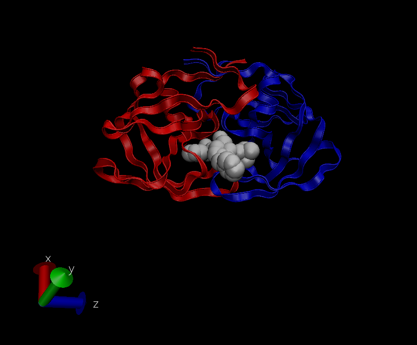

## 1: Introduction to the RCSB Protein Data Bank (PDB)

#### PDB statistics

Download a CSV file from the PDB site (accessible from "Analyze" \> "PDB Statistics" \> "by Experimental Method and Molecular Type".

```{r}
db <- read.csv("Data Export Summary.csv", row.names=1)
head(db)
```

> **Q1.** What percentage of structures in the PDB are solved by X-Ray and Electron Microscopy.

```{r}
col.sums <- colSums(db) 
round(col.sums/col.sums["Total"]*100,2)
```

> **A1.** **87.55%** of structures in the PDB are solved by X-Ray Microscopy, while 4.92% of structures in the PDB are solved by Electron Microscopy.

> **Q2.** What proportion of structures in the PDB are protein?

```{r}
row.sums <- rowSums(db) 
round(row.sums["Protein (only)"]/sum(col.sums)*100,2)
```

> **A2.** **87.36%** of the structures in the PDB are Protein (only).

> **Q3.** Type HIV in the PDB website search box on the home page and determine how many HIV-1 protease structures are in the current PDB?

> **A3.** There are **1828** HIV-1 protease structures in the current PDB.

#### The PDB format

## 2. Visualizing the HIV-1 protease structure

#### Getting to know VMD

> **Q4.** Water molecules normally have 3 atoms. Why do we see just one atom per water molecule in this structure?

> **A4.** The Oxygen atoms, but not the Hydrogen atoms, can be detected experimentally via x-ray cyrstalography. This means we can only see the Oxygen atoms of water in our representations.

> **Q5.** There is a conserved water molecule in the binding site. Can you identify this water molecule? What residue number does this water molecule have (see note below)?

> **A5.** The conserved water molecule has the residue number **127**.

{width="462"}

> **Q6.** As you have hopefully observed HIV protease is a homodimer (i.e. it is composed of two identical chains). With the aid of the graphic display and the sequence viewer extension can you identify secondary structure elements that are likely to only form in the dimer rather than the monomer?

> **A6.** The binding site is in between the two halves of the dimer. This suggests that the ligand would not be able to bind to the HIV protease if it was a monomer instead of a dimer. 
