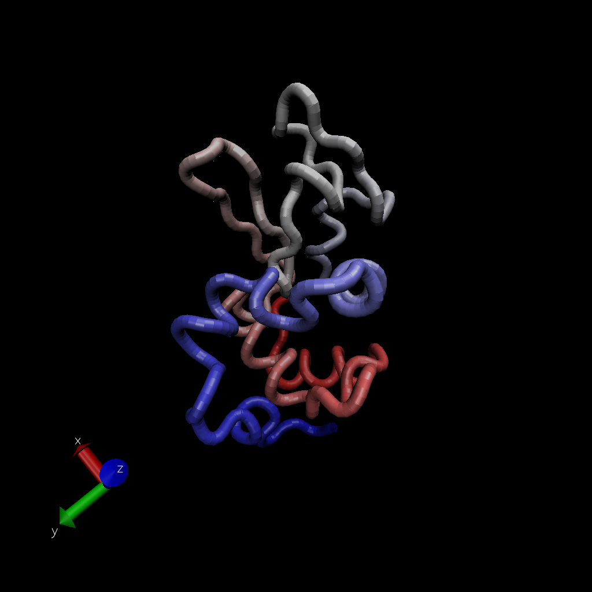

## 3. Introduction to Bio3D in R

```{r}
library(bio3d)
```

#### Reading PDB file data into R

```{r}
##  Accessing on-line PDB file
pdb <- read.pdb("1hsg")
pdb
```

> **Q7.** How many amino acid residues are there in this PDB object?

```{r}
length(pdbseq(pdb))
```

> **A7.** There are **198** amino acid residues in this PDB object.

> **Q8.** Name one of the two non-protein residues?

> **A8.** **HOH** (water) is one of the non-protein residues.

> **Q9.** How many protein chains are in this structure?

> **A9.** There are **2** protein chains in this structure.

```{r}
attributes(pdb)
```

```{r}
head(pdb$atom)
```

Let's use a bioinformatics method called NMA (Normal Mode Analysis ) to predict the dynamics (flexibility).

```{r}
modes <- nma(pdb)
plot(modes)
```

Make a "move" of its predicted motion. We often call this a "trajectory".

```{r}
mktrj(modes, file="nma.pdb")
```

{width="264"}

## 4. Comparative structure analysis of Adenylate Kinase

```{r}
# Install packages in the R console not your Rmd

#install.packages("bio3d")
#install.packages("ggplot2")
#install.packages("ggrepel")
#install.packages("devtools")
#install.packages("BiocManager")

#BiocManager::install("msa")
#devtools::install_bitbucket("Grantlab/bio3d-view")
```

> **Q10.** Which of the packages above is found only on BioConductor and not CRAN?

> **A10.** **msa** is only found on BioConductor.

> **Q11.** Which of the above packages is not found on BioConductor or CRAN?

> **A11.** **bio3d-view** is not found on BioConductor or CRAN.

> **Q12.** True or False? Functions from the devtools package can be used to install packages from GitHub and BitBucket?

> **A12.** **TRUE**

#### Search and retrieve ADK structures

```{r}
aa <- get.seq("1ake_A")
aa
```

> **Q13.** How many amino acids are in this sequence, i.e. how long is this sequence?

> **A13.** This sequence is 214 amino acids long.
