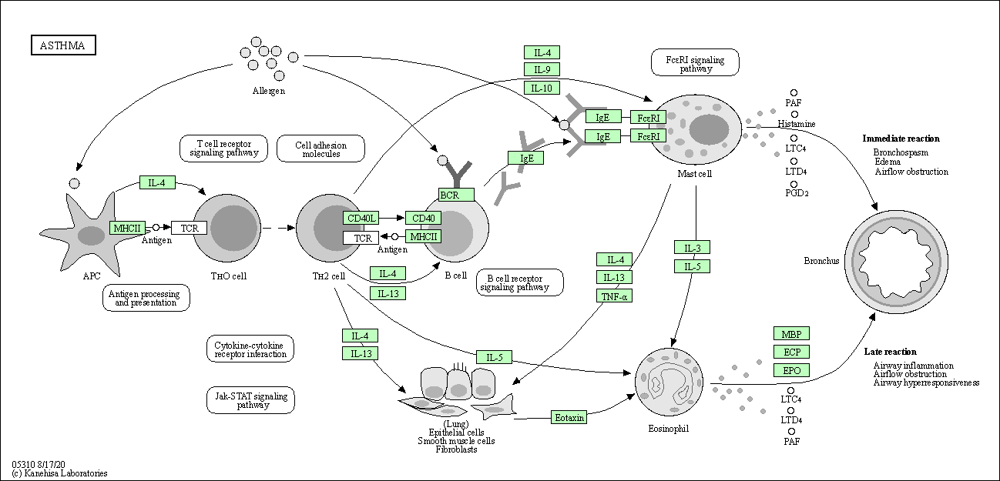

## Background

Our data is from Himes et al. RNASeq analysis of the drug dexamethasone, a synthetic glucocorticoid steroid with anti-inflammatory effects (Himes et al. 2014).

## 1. Bioconductor and DESeq2 setup

## 2. Import countData and colData

Read the countData & colData

```{r}
counts <- read.csv("airway_scaledcounts.csv", row.names=1)
metadata <-  read.csv("airway_metadata.csv")
```

Inspect data.

```{r}
head (counts)
```

```{r}
head(metadata)
```

> **Q1.** How many genes are in this dataset?

```{r}
nrow(counts)
```

> **A1.** There are **38694** genes in this data set.

> **Q2.** How many 'control' cell lines do we have?

```{r}
metadata$dex
sum(metadata$dex == "control")
```

> **A2.** There are **4** control cell lines in this data set.

## 3. Toy differential gene expression

First, we need to extract all the "control" columns. Then we will take the rowwise mean to get the average count value for all genes in these 4 experiments.

```{r}
control <- metadata[metadata[,"dex"]=="control",]
control.counts <- counts[ ,control$id]
control.mean <- rowSums( control.counts )/4 
head(control.mean)
```

> **Q3.** How would you make the above code in either approach more robust?

```{r}
control.inds <- metadata$dex == "control" 
control.counts <- counts [ ,control.inds]
head(control.counts)
```

```{r}
control.mean <- rowMeans(control.counts)
```

> **Q4.** Follow the same procedure for the treated samples (i.e. calculate the mean per gene across drug treated samples and assign to a labeled vector called treated.mean)

```{r}
treated.inds <- metadata$dex == "treated" 
treated.counts <- counts [ ,treated.inds]
head(treated.counts)
treated.mean <- rowMeans(treated.counts)
```

Combine meancount data.

```{r}
meancounts <- data.frame(control.mean, treated.mean)
colSums(meancounts)
```

> **Q5 (a).** Create a scatter plot showing the mean of the treated samples against the mean of the control samples. Your plot should look something like the following.

```{r}
plot(x=control.mean, y=treated.mean, xlab="Control", ylab="Treated")
```

> **Q5 (b).** You could also use the ggplot2 package to make this figure producing the plot below. What geom\_?() function would you use for this plot?

```{r}
library(ggplot2)
ggplot(data=counts) + 
  aes (x=control.mean, y=treated.mean) + 
  geom_point() 
```

> **A5.** You can use **geom_point** to make this graph.

This plot suggests that we need a log transformation!

> **Q6.** Try plotting both axes on a log scale. What is the argument to plot() that allows you to do this?

```{r}
plot(meancounts, log="xy")
```

> **A6.** The aregument **log="xy"** allows for plotting both axes on the log scale.

We often use log2 in this field because it has nice math properties that make interpretation easier.

```{r}
log2(10/10)
```

```{r}
log2(20/10)
```

```{r}
log2(40/10)
```

```{r}
log2(5/10)
```

There are 0 values for no change, (+) values for increases, and (-) values for decreases. This property leads us to work with **log2(fold-change)** in the genomics & proteomics fields.

Let's add the **log2(fold-change)** values to our 'meancounts' data frame.

```{r}
meancounts$log2fc <- log2(meancounts[,"treated.mean"]/meancounts[,"control.mean"])
head(meancounts)
```

Exclude columns with NaN & Inf in log2fc by excluding the genes (i.e. rows) with 0 counts. We can't say anything about these, as we have no data for them!

```{r}
head(meancounts[,1:2] == 0)
```

Use the **which()** function with the 'arr.ind=TRUE' argument to get the columns & rows where the TRUE values (i.e the zero counts in our case) are located.

```{r}
zero.vals <- which(meancounts[,1:2] ==0, arr.ind=TRUE)
head(zero.vals)
```

> **Q7.** What is the purpose of the arr.ind argument in the which() function call above? Why would we then take the first column of the output and need to call the unique() function?

> **A7.** The arr.ind function returns the row & column positions for when the which clause is true. In this example, we can use this to locate the positions fo rows with 0 values. There may be some samples with 0 values in both of the columns, so using the unique() function ensures that they're not double-counted.

```{r}
to.rm <- unique(zero.vals[,"row"])
head(sort(to.rm))
```

Now, remove these from our `meancounts` dataframe.

```{r}
mycounts <- meancounts[-to.rm,]
head(mycounts)
```

How many do wwe have left?

```{r}
nrow(mycounts)
```

> **Q8.** Using the up.ind vector above can you determine how many up regulated genes we have at the greater than 2 fc level?

```{r}
up.ind <- mycounts$log2fc > 2
sum(up.ind ==TRUE)
```

> **A8.** Thereare **250** up regulated genes at teh greater than 2fc level.

> **Q9.** Using the down.ind vector above can you determine how many down regulated genes we have at the greater than 2 fc level?

```{r}
down.ind <- mycounts$log2fc < (-2)
sum(down.ind == TRUE)
```

> **A9.** There are **367** down regulated genes we have at the greater than 2 fc level.

> **Q10.** Do you trust these results? Why or why not?

> **A10.** No, we have not accounted for the data being statistically significant are not. There can be a large, statistically insignificant fold-change.

## 4. DESeq2 analysis

Let's do this the right way. DESeq2 is an R package specifically for analyzing count-based NGS data like RNA-seq. It is available from Bioconductor.

```{r}
library(DESeq2)
citation("DESeq2")
```

Setup required

```{r}
dds <- DESeqDataSetFromMatrix(countData=counts, 
                              colData=metadata, 
                              design=~dex)
dds
```

Now we can run or DESeq analysis

```{r}
dds <- DESeq(dds)
```

To get the results, we use the deseq `results()` function:

```{r}
res <- results(dds) 
head(res)
```

```{r}
summary(res)
```

```{r}
res05 <- results(dds, alpha=0.05) 
summary(res05) 
```

<<<<<<< HEAD
#### Save our results

Write out whole results datavset (including genes that don't change significantly):

```{r}
write.csv(res, file="allmyresults.csv")
```

Focus in on those genes with a small p-value:

```{r}
res05 <- results(dds, alpha = 0.05)
```

```{r}
summary(res05)
```

## 5. Adding annotation data

For this, we need 2 bioconductor packages: `BiocManager::install("AnnotationDbi")` and `BiocManager::install("org.Hs.eg.db")`.

```{r}
library("AnnotationDbi")
library("org.Hs.eg.db")
```

Let's have a look at what is in the `org.Hs.eg.db`.

```{r}
columns(org.Hs.eg.db)
```

We will use `mapIDs` function to translate between identifiers from different databases.

```{r}
res$symbol <- mapIds(org.Hs.eg.db,
                     keys=row.names(res), # Our genenames
                     keytype="ENSEMBL",   # Their format 
                     column="SYMBOL",     # new format we want
                     multiVals="first")
```

```{r}
head(res)
```

We will need ENTREZ ids for pathway analysis with KEGG.

```{r}
res$entrez <- mapIds(org.Hs.eg.db,
                     keys=row.names(res), # Our genenames
                     keytype="ENSEMBL",   # Their format 
                     column="ENTREZID",     # new format we want
                     multiVals="first")
```

```{r}
head(res)
```


> **Q11.** Run the mapIds() function two more times to add the Entrez ID and UniProt accession and GENENAME as new columns called res$entrez, res$uniprot and res$genename.

```{r}
res$entrez <- mapIds(org.Hs.eg.db,
                     keys=row.names(res),
                     column="ENTREZID",
                     keytype="ENSEMBL",
                     multiVals="first")

res$uniprot <- mapIds(org.Hs.eg.db,
                     keys=row.names(res),
                     column="UNIPROT",
                     keytype="ENSEMBL",
                     multiVals="first")

res$genename <- mapIds(org.Hs.eg.db,
                     keys=row.names(res),
                     column="GENENAME",
                     keytype="ENSEMBL",
                     multiVals="first")

head(res)
```

=======
>>>>>>> c533ab5c322510503735581509b2d53579634390
## 6. Data Visualization

#### Volcano Plots

Let's make a commonly produced visualization from this data, namely a so-called Volcano plot. These summary figures are frequently used to highlight the proportion of genes that are both significantly regulated and display a high fold change.

```{r}
plot(res$log2FoldChange, res$padj)
```

This is not a useful plot because all the small p-values are hidden at the bottom of the plot, so we can't see them. Log will help.

```{r}
plot(res$log2FoldChange, log(res$padj))
```

We can filp this pvalue axis by putting a minus sign on -log(res\$padj). Then, we will have a classic volcano plot.

```{r}
plot(res$log2FoldChange, -log(res$padj))
```

Adding customizations to draw attention to the genes (points) that we care about.
<<<<<<< HEAD

```{r}
# Setup our custom point color vector 
mycols <- rep("gray", nrow(res))
mycols[ abs(res$log2FoldChange) > 2 ]  <- "red" 

inds <- (res$padj < 0.01) & (abs(res$log2FoldChange) > 2 )
mycols[ inds ] <- "blue"

# Volcano plot with custom colors 
plot( res$log2FoldChange,  -log(res$padj), 
 col=mycols, ylab="-Log(P-value)", xlab="Log2(FoldChange)" )

# Cut-off lines
abline(v=c(-2,2), col="gray", lty=2)
abline(h=-log(0.1), col="gray", lty=2)
```

## Section 6 Cont.

Let's make another volcano plot with some gene labels: For this, we can use the `EnhancedVolcano` package.

```{r}
library(EnhancedVolcano)

x <- as.data.frame(res)

EnhancedVolcano(x,
    lab = x$symbol,
    x = 'log2FoldChange',
    y = 'pvalue')
```

## 7. Pathway analysis

Install bioconductor packages: `BiocManager::install( c("pathview", "gage", "gageData") )`

```{r}
library(pathview)
library(gage)
library(gageData)

data(kegg.sets.hs)

# Examine the first 2 pathways in this kegg set for humans
head(kegg.sets.hs, 2)
```

The main `gage()` function requires a named vector of **fold changes**, where the names of the values are the Entrez gene IDs.

```{r}
# res$entrez
foldchanges <- res$log2FoldChange
names(foldchanges) <- res$entrez

head(foldchanges)
```

```{r}
# Get the results
# keggres = gage(as.vector(foldchanges), gsets=kegg.sets.hs)
```

```{r}
# attributes(keggres)
```

```{r}
# Look at the first three down (less) pathways
# head(keggres$less, 3)
```

Now, let's try out the `pathview()` function from the **pathview package** to make a pathway plot with our RNA-Seq expression results shown in color.

```{r}
pathview(gene.data=foldchanges, pathway.id="hsa05310")
```



## 7. Pathway analysis

In console: install "pathview", "gage", "gageData". 

```{r}
library(pathview)
library(gage)
library(gageData)

data(kegg.sets.hs)

# Examine the first 2 pathways in this kegg set for humans
head(kegg.sets.hs, 2)
```

```{r}
foldchanges = res$log2FoldChange
names(foldchanges) = res$entrez
head(foldchanges)
```

```{r}
# Get the results
keggres = gage(foldchanges, gsets=kegg.sets.hs)
```

```{r}
attributes(keggres)
```

```{r}
# Look at the first three down (less) pathways
head(keggres$less, 3)
```

```{r}
pathview(gene.data=foldchanges, pathway.id="hsa05310")
```

> **Q12.** Can you do the same procedure as above to plot the pathview figures for the top 2 down-reguled pathways?

```{r}
#keggresnew = gage(foldchanges, gsets=kegg.sets.hs, same.dir=FALSE)
```

=======
>>>>>>> c533ab5c322510503735581509b2d53579634390
